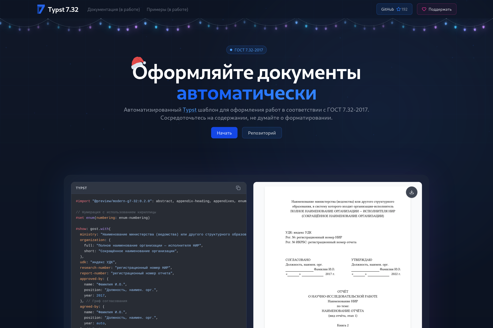

# Typst Gost Website

<a href="https://github.com/typst-gost/website/blob/main/LICENSE"></a>
<a href="https://github.com/typst-gost/website/actions"></a>
<a href="https://typst-gost.ru"></a>

Официальный сайт проекта Typst Gost - экосистема шаблонов для оформления документов в соответствии с ГОСТ.



Проект создан на базе [Next.js](https://nextjs.org) с использованием [Nextra](https://nextra.site/) для генерации документации.

## Быстрый старт

### Установка Bun

Проект использует [Bun](https://bun.sh) как пакетный менеджер и runtime. Установите Bun одним из способов:

#### Linux/macOS
```bash
curl -fsSL https://bun.sh/install | bash
```

#### Windows (PowerShell)
```powershell
irm bun.sh/install.ps1 | iex
```

#### Через npm
```bash
npm install -g bun
```

### Запуск проекта

1. **Клонируйте репозиторий:**
   ```bash
   git clone https://github.com/typst-gost/website.git
   cd website
   ```

2. **Установите зависимости:**
   ```bash
   bun install
   ```

3. **Запустите сервер разработки:**
   ```bash
   bun dev
   ```

4. Откройте [http://localhost:3000](http://localhost:3000) в браузере

### Доступные команды

```bash
bun dev          # Запуск сервера разработки
bun build        # Сборка проекта для продакшена
bun start        # Запуск production сервера
bun lint         # Проверка кода линтером
```

## Структура проекта

```
.
├── src/
│   ├── app/         # Next.js App Router
│   ├── components/  # React компоненты
│   └── lib/         # Утилиты и хелперы
├── public/          # Статические файлы
├── docs/           # Файлы документации (MDX)
└── package.json
```

## Технологии

- **[Next.js](https://nextjs.org)** - React фреймворк для веб-приложений
- **[Nextra](https://nextra.site/)** - статический генератор сайтов на базе Next.js
- **[Tailwind CSS](https://tailwindcss.com)** - CSS фреймворк
- **[TypeScript](https://www.typescriptlang.org)** - типизированный JavaScript
- **[Bun](https://bun.sh)** - быстрый пакетный менеджер и runtime

## Документация

- **[Next.js документация](https://nextjs.org/docs)** - изучите возможности Next.js
- **[Nextra документация](https://nextra.site/docs)** - руководство по созданию документации
- **[Tailwind CSS документация](https://tailwindcss.com/docs)** - справочник по стилизации
- **[Bun документация](https://bun.sh/docs)** - руководство по использованию Bun

## Правила контрибуции

### Как внести вклад

1. **Форк репозитория** через GitHub интерфейс
2. **Создайте ветку** для ваших изменений:
   ```bash
   git checkout -b feature/описание-изменений
   ```
3. **Внесите изменения** и протестируйте их локально
4. **Зафиксируйте изменения** с понятным сообщением:
   ```bash
   git commit -m "feat: добавить новую функциональность"
   ```
5. **Отправьте изменения** в ваш форк:
   ```bash
   git push origin feature/описание-изменений
   ```
6. **Создайте Pull Request** с подробным описанием

### Требования к коду

- **Линтинг:** Код должен проходить проверку ESLint
  ```bash
  bun lint
  ```
- **Типизация:** Используйте TypeScript для новых файлов
- **Стилизация:** Следуйте существующим паттернам оформления
- **Тестирование:** Убедитесь, что проект собирается без ошибок
  ```bash
  bun build
  ```

### Pull Request

#### Требования к PR

- **Описание:** Четко опишите, что изменяется и почему
- **Линейность:** Один PR = одна функция/исправление
- **Размер:** Избегайте слишком больших PR (>500 строк)
- **Тестирование:** Убедитесь, что проект собирается и работает

#### Шаблон описания PR

```markdown
## Описание изменений
Кратко опишите ваши изменения

## Тип изменений
- [ ] Исправление ошибки (fix)
- [ ] Новая функциональность (feature)
- [ ] Критическое изменение (breaking change)
- [ ] Обновление документации (docs)

## Тестирование
- [ ] Код успешно собирается (`bun build`)
- [ ] Линтер не выдает ошибок (`bun lint`)
- [ ] Проверена работа в браузере
- [ ] Проверена адаптивность (мобильные устройства)

## Дополнительная информация
Добавьте любую дополнительную информацию о PR
```

### Процесс ревью

1. **Автоматические проверки** должны пройти успешно
2. **Ревью кода** от мейнтейнеров проекта
3. **Линейные комментарии** для обсуждения конкретных строк кода
4. **Общие комментарии** для обсуждения архитектурных решений
5. **Одобрение и мерж** после устранения замечаний

### Стандарты кода

- **Форматирование:** Используется Prettier (настройки в `.eslintrc.json`)
- **Именование файлов:** `kebab-case` для компонентов и страниц
- **Импорты:** Абсолютные пути через `@/` alias
- **Компоненты:** Функциональные компоненты с TypeScript

## Деплой

Проект автоматически деплоится через GitHub Actions при push в `main` ветку.

## Лицензия

Проект распространяется под лицензией GPL-3.0. См. файл [LICENSE](LICENSE) для подробностей.

## Связь

- **Сайт:** [typst-gost.ru](https://typst-gost.ru)
- **Репозиторий:** [github.com/typst-gost/website](https://github.com/typst-gost/website)
- **Issues:** [github.com/typst-gost/website/issues](https://github.com/typst-gost/website/issues)
